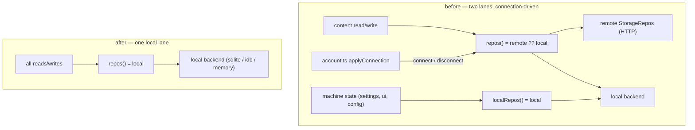

# Task 1 — Implementation guide: remove the remote backend

Guide for [task.md](task.md). Reads target-first: what exists when done, then the
touch-lists and the surgical seams. The remote feature is cleanly bounded but
**entangled at four shared seams** — the `StorageEngine`, the `Consumer.synced`
flag, the `ContainerType` `"remote"` discriminant, and the two init files — so the
work is *mostly clean deletion plus a few in-place edits that must keep the local
lane alive*.

## Decisions to confirm

- **D1 — Collapse the storage lanes to one method.** `repos()` and `localRepos()`
  become one local accessor. Keep the name **`repos()`**; repoint `localRepos()`
  callers to it (`consumer.ts`, `version.ts`). Two names for one provider is exactly
  what [consolidation](../../conventions/consolidation.md) forbids. *(Recommended.)*
- **D2 — Drop the `remote` container type and the VM tools tier with the account.**
  `ContainerType`'s `"remote"` member and `core/tools/remote/` (the VM-backed
  workspace tier, `BaseRemoteTool`) are reachable only behind a connected account
  (`Sidebar` gates `addRemote` on `connected`). With the account gone they are dead.
  *(Recommended: remove both. Veto if the VM tier is meant to survive as a local
  capability — then it needs a new, non-account entry point, which is its own task.)*
- **D3 — Keep a local profile (name/avatar), drop everything else in `account.ts`.**
  `getAccount`/`saveAccount` carry a non-remote `username`/`avatar` the `Sidebar`
  renders. Salvage those into a small **machine-local** consumer (or `ui` state);
  delete all connection/token/endpoint fields and methods. *(Recommended. Alternative:
  drop the profile too and simplify the Sidebar — say the word.)*
- **D4 — Drop `SettingRow.scope` entirely** rather than pinning it to `"local"`. It
  existed only to route account-synced vs machine-local writes; with one lane it is
  inert. Data resets on version bump ([ADR-0075](../../adr/0075-breaking-change-data-reset.md)),
  so no migration is owed. *(Recommended. Alternative: keep the column, always write
  `"local"` — smaller diff, leaves an unused field.)*

## Per-root overview — what exists when done

### `apps/desktop` (stays; remote seam removed)

| Piece | What it is when done |
| --- | --- |
| `core/storage/engine.ts` | A `StorageEngine` over a **single local provider**; `repos()` returns it. No `remote`, `connect`, `disconnect`, `connected`. |
| `core/storage/{idb,memory}.ts`, `electron/sqlite*` | Unchanged — the local backends solo mode runs on. |
| `core/storage/consumer.ts` | `Consumer` with no `synced` param; always persists locally. |
| `core/storage/types.ts` | `StorageRepos` + entity repos unchanged; `SettingRow` loses `scope` (D4). |
| `core/account.ts` | **Gone.** A minimal local profile (name/avatar, D3) lives in a machine-local consumer. |
| `core/tools/account/` | **Gone** — the memory tools removed with the KB. |
| `core/tools/remote/`, `ContainerType "remote"` | **Gone** (D2). |
| `pages/settings/AccountSection.tsx` | **Gone** (or reduced to a local-profile field, D3). |
| init (`electron/init.ts`, `web/init.ts`) | Construct `new StorageEngine(local)`; no `attachAccount`/`remoteRepos`/account-tool globs. |

### `apps/knowledge` — **deleted entirely**

The whole Hono service (auth, `/data` per-entity routers, `/kb`, inngest, docker).
Nothing in `apps/desktop` imports it (HTTP-only), so it is a clean directory delete
plus workspace de-registration.

### `docker/` — **deleted entirely**

Every service there (Traefik, MariaDB/adminer, `knowledge`, OpenSearch/dashboards,
TEI embeddings, inngest) exists only for the remote backend. A local-only harness
ships no docker stack.

## Flow — the storage engine, before and after



## Contract — surfaces removed (all removals; none deferred)

| Surface | Detail |
| --- | --- |
| HTTP (whole service) | `/health`, `/auth/{register,login,refresh,logout}`, `/data/*` per-entity routers, `/kb`, `/kb/search`, `/kb/:id`, `/inngest` |
| Renderer tools | `SaveMemory`, `SearchMemory`, `GetMemory`, `EditMemory`, `DeleteMemory` (dropped from the registry) |
| `StorageEngine` API | `connect()`, `disconnect()`, `get connected()`, the `remote` ctor arg, `localRepos()` (→ `repos()`, D1) |
| `account.ts` API | `Connection` type, `isConnected`, `attachAccount`, `applyConnection`, `setConnection`, `login`, `register`, `logout`, `refresh`/`doRefresh`, `authedFetch`, `authPost`, `authenticate` |
| `remoteRepos(fetch)` + `AuthedFetch` | file deleted (`core/storage/remote.ts`) |
| `ContainerType` | `"remote"` member removed (D2) |

## Data shapes changed

**`SettingRow`** (`core/storage/types.ts`) — D4:

| Column | Before | After |
| --- | --- | --- |
| `key` | `string` | `string` (unchanged) |
| `value` | `string` (JSON) | unchanged |
| `scope` | `"local" \| "account"` | **removed** |

**`ContainerType`** (`core/containers.ts`) — D2: members `"chat" | "local" | "remote"`
→ `"chat" | "local"`.

## File touch-lists

### `apps/desktop/src` — clean deletes

| Path | Files | What |
| --- | --- | --- |
| `core/` | `account.ts` | delete; salvage name/avatar → local consumer (D3) |
| `core/storage/` | `remote.ts` | delete (`remoteRepos`, `AuthedFetch`) |
| `core/tools/account/` | `base.ts`, `saveMemory.ts`, `searchMemory.ts`, `getMemory.ts`, `editMemory.ts`, `deleteMemory.ts` | delete folder (the KB memory tools) |
| `core/tools/remote/` | `base.ts` (+ any tier files) | delete folder (VM tier, D2) |
| `pages/settings/` | `AccountSection.tsx` | delete (or reduce to local-profile field, D3) |
| `tests/` | `account.test.ts`, `memory-tools.test.ts` | delete |

### `apps/desktop/src` — surgical edits (local lane must survive)

| Path | Files | What |
| --- | --- | --- |
| `core/storage/` | `engine.ts` | collapse to one local provider; `repos()` returns it; drop `remote`/`connect`/`disconnect`/`connected`/`localRepos` (D1) |
| `core/storage/` | `consumer.ts` | drop `synced` param + `repos()` branch → `ctx.storage.repos()`; drop `scope` write (D4); `hydrateConsumers` needed at init only |
| `core/storage/` | `types.ts` | drop `SettingRow.scope` (D4); scrub remote/soft-delete comments |
| `core/storage/` | `version.ts` | `localRepos().wipe()` → `repos().wipe()` |
| `core/` | `containers.ts` | drop `"remote"` from `ContainerType` (D2) |
| `core/config/` | `app.ts` | `new Consumer(..., synced=true)` → drop the arg |
| `core/` | `settings.ts` | same Consumer-arg drop; scrub `account`-scope assertions |
| `plugins/` | `config.ts` | same Consumer-arg drop |
| `core/sessions/` | `engine.ts` | remove the `connected: isConnected()` debug field |
| `core/sessions/` | `store.ts` | simplify the offline-vs-connected reset branches to the local path |
| `electron/` | `init.ts` | `new StorageEngine(local)`; drop `attachAccount`/`remoteRepos`/`isConnected` imports, the `ACCOUNT_MODULES` glob, the account tool registry merge |
| `web/` | `init.ts` | same; drop `core/tools/account/*` from `MODULES` |
| `pages/settings/` | `register.tsx` | remove the `id: "account"` registration; renumber `order` |
| `pages/settings/` | `StorageSection.tsx` | drop the `.connected` read + `storage.backend_remote` string |
| `pages/workspace/` | `Sidebar.tsx` | remove `addRemote`, the `remote` block + `Globe` icon, the `isConnected`/`useAccount` import (keep `chat`/`local`) |
| `pages/workspace/` | `AgentsPanel.tsx`, `GraphsPanel.tsx`, `AgentRunView.tsx` | drop the `activeType === "remote"` branches (D2) |
| `locales/` | `en.json`, `lt.json` | delete the `account` block, `sidebar.remote`, `storage.backend_remote` (keep en/lt parity) |

### repo root & deleted roots

| Path | Files | What |
| --- | --- | --- |
| `/` | `pnpm-workspace.yaml`, `package.json` | drop the `apps/knowledge` workspace glob / any `--filter @v84-harness/knowledge` script |
| `apps/knowledge/` | (whole) | delete |
| `docker/` | (whole) | delete |

### tests to re-check (not blind deletes)

`tests/consumer.test.ts` and `tests/settings.test.ts` assert on `synced`/`scope`;
`tests/setup.ts` / `tests/ctx.ts` may stand up a fake account/remote — grep and
strip the remote assumptions, keep the local-behaviour assertions.

## Key logic sketches

**`StorageEngine` after (D1):**

```ts
// core/storage/engine.ts — one provider, no connection concept
export class StorageEngine {
  constructor(private readonly local: StorageRepos) {}
  repos(): StorageRepos { return this.local }
  // connect/disconnect/connected and the remote arg are gone
}
```

**`Consumer` after (D1 + D4):** the `synced` branch and the `scope` stamp collapse.

```ts
// core/storage/consumer.ts
private repos() { return this.ctx.storage.repos() }          // was: synced ? repos() : localRepos()
async persist() { await this.repos().settings.put({ key: this.key, value }) } // no scope
```

**init after:** `new StorageEngine(local)` — the local backend is still chosen by the
capability probe (`sqliteRepos()` when `api.storage.available()`, else `idbRepos()`);
only the remote attach and account-tool wiring are removed.

## Verification plan (ordered gates)

1. **No dangling references** — `grep -rn` across `apps/desktop/src` for
   `account`, `authedFetch`, `isConnected`, `remoteRepos`, `connected`, `synced`,
   `"remote"`, `/kb`, `knowledge` returns only intentional survivors (the DB-plugin
   `isConnected(name)`, the MCP OAuth tokens, unrelated LLM provider "endpoint"s).
2. **`pnpm typecheck`** green across the workspace (proves the seam edits type-check
   without the deleted symbols).
3. **`pnpm test`** green; the deleted tests are gone, `consumer`/`settings` tests
   pass against the single lane.
4. **App launches, both targets** — `pnpm dev` (web) and `pnpm dev:electron`: a chat
   round-trips and re-hydrates after reload from local storage; no Account section,
   no remote sidebar entry, no memory tools advertised.
5. **Docs pass** (end-of-session) — map is current truth; `knowledge.md` removed; the
   obsoleted ADRs superseded + archived-with-stubs ([documentation](../../instructions/documentation.md)
   rule 2); glossary terms retired; a new ADR records the local-only posture.
