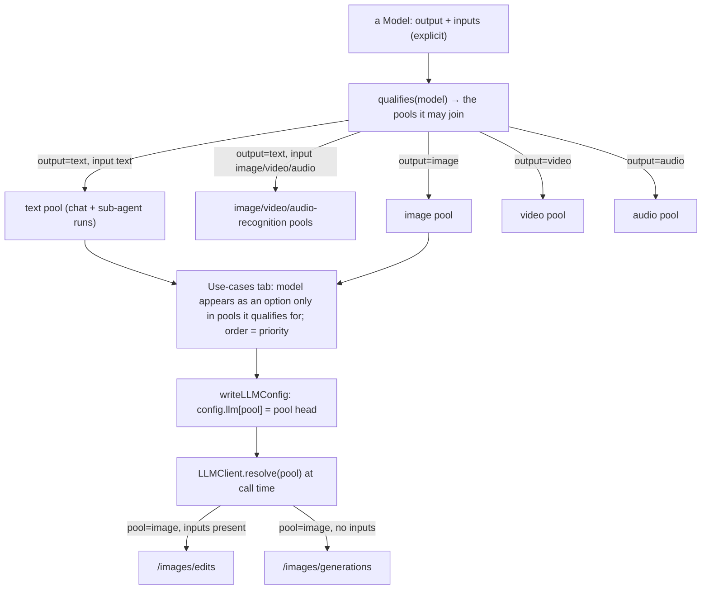

# Task 2 — Implementation guide: unify providers, gate pools by input → output

Guide for [task.md](task.md). The data model is already unified (`providers`/`services`,
`config.llm` derived); this task fixes the **capability declaration** (output + inputs),
**reduces the service set to 7 named pools**, **gates pool membership** on a model's in/out
([capability-gating](../../conventions/capability-gating.md)), **merges the two settings
screens**, and **drops the seed**. Reads target-first.

## Per-root overview — `apps/desktop/src` when done

| Piece | What it is |
| --- | --- |
| `llm/types.ts` | `ModelService` = the **7 pools**: `text` · `image` · `video` · `audio` · `imageRec` · `videoRec` · `audioRec` (`main`+`subAgent`→`text`; `imageGen`+`imageEdit`→`image`; `videoGen`→`video`; `audioGen`→`audio`). `SERVICE_MODALITY` updated. A `Modality` vocabulary for output + accepted inputs. **`ProviderKind` = `openai \| anthropic \| gemini`** (the `generate` dialect dropped); `MediaApiKind` removed. |
| `core/settings.ts` | `Model` declares **`output: Modality`** + **`input: {text?,image?,video?,audio?}`** (all four explicit) — replaces flat `capabilities`; no role field. `qualifies(model)` **gates** which pools it may join. `providerCaps(api)` gates the Output choices by dialect (**openai** → all four, **anthropic/gemini** → text only). `addModel` **carries `provider.modelLimits[wireId]`** onto a new model (the detected context length). `DEFAULTS` seed **removed**. `resolveConfig`/pools keyed by the new services. `useProvider` (synthesized chat view) sourced from the **`text`** pool head. |
| `core/config/pools.ts` + the concurrency runner | `subAgent` pool gone; a sub-agent run is a **background lease priority** on the `text` pool, `reserve` = foreground-held slots (was the main-vs-subAgent split). |
| `pages/settings/ModelsSection.tsx` | The one "Providers" section — Providers + Use-cases tabs; Use-cases lists the 7 pools; the per-model editor is **two sections — Input (Text·Image·Video·Audio) and Output (the produced modality)**, revealing text knobs for text output and max-size for image/video. Text knobs include a manual **Context length** input. API dropdown offers **OpenAI / Anthropic / Gemini** (the `generate`/bare-endpoint path removed). |
| `llm/providers/image/generate.ts` | **Deleted** — the bare `/generate` image dialect (obsolete; boxes serve the OpenAI Images API). Its two dialect-only tests deleted with it. |
| `pages/settings/ProviderSection.tsx` | **Deleted** (its text knobs fold into the model editor). |
| `pages/settings/register.tsx` | The "provider" tab removed; "media" tab → **"Providers"** (route `settings/providers`), icon kept. |
| `core/config/llm.ts` | `LLMConfigList` keyed by the new `ModelService`; shapes unchanged (chat reads `config.llm.text`, was `.main`). |
| tools | `ImageGenerate`/`ImageEdit` resolve **`image`**; `VideoGenerate` resolves **`video`**; `ImageDescribe`/`VideoDescribe` resolve `imageRec`/`videoRec`. `ImageCompose`→`ImageEdit` (file/class/name). |
| `locales/{en,lt}.json` | One "providers" block (pool labels: "Image edit" not "compose"); `ProviderSection` strings removed. |

## Flow — capability gates pool → resolution



## Contract — the service set (the reorg)

| Before (9) | After (7 pools) | Note |
| --- | --- | --- |
| `main`, `subAgent` | **`text`** | one pool; sub-agent runs = background priority + `reserve`, not a separate model |
| `imageGen`, `imageEdit` | **`image`** | endpoint chosen by input presence (× the collapse) |
| `videoGen` | **`video`** | i2v/v2v by inputs |
| `audioGen` | **`audio`** | |
| `imageRec`, `videoRec`, `audioRec` | unchanged | output=text + that input |

## Data shapes

**`Model`** (`core/settings.ts`):

| Field | Before | After |
| --- | --- | --- |
| `capabilities` | `ModelService[]` | **removed** |
| `output` | — | `Modality` (`text`\|`image`\|`video`\|`audio`) |
| `input` | `{image,video,audio}` (text only) | `{text?,image?,video?,audio?}` on **all** models — each accepted input explicit (a transcriber = audio-only, a pure i2v = image-only) |
| chat knobs (`maxTokens`, `reasoningEffort`, `thinkingBudget`, `contextLength`, `imageMaxDim`, `contextReserve`) | present | unchanged (editor shows them when `output==="text"`) |
| media knobs (`promptStyle`, `maxImageSize`, `maxVideoSize`) | present | unchanged (shown per output) |

No `roles` field — chat membership is derived (`output===text && input.text`).

**`SettingsState.services`** — keyed by the new `ModelService`; `DEFAULTS` becomes
`{ providers: [], services: {} }` (empty — no seeded provider/model/assignment).

## File touch-lists

### `apps/desktop/src` — surgical

| Path | Files | What |
| --- | --- | --- |
| `llm/` | `types.ts` | `MEDIA_SERVICES`/`ModelService`/`SERVICE_MODALITY` → the 7 pools; `Modality` vocabulary |
| `core/` | `settings.ts` | `Model` output/inputs (drop `capabilities`/roles); `qualifies()` gate; `slotOptions`/`providerCaps` → derived; `resolveConfig` keys; empty `DEFAULTS`; `useProvider` from `text` head |
| `core/config/` | `pools.ts` | drop the `subAgent` pool; sub-agent = background priority on `text`, `reserve` = foreground slots |
| `core/config/` | `llm.ts` | keys follow `ModelService`; chat reads `config.llm.text` |
| `core/` | (concurrency runner) | main/subAgent priority → foreground/background on the `text` pool |
| `core/tools/general/` | `imageGenerate.ts`, `imageCompose.ts`→`imageEdit.ts`, `videoGenerate.ts` | resolve `image`/`video`; rename ImageCompose→ImageEdit (class, `schema.function.name`) |
| `core/tools/helpers/` | `imageGeneration.ts` | resolve `image` once; endpoint still by `inputs` presence (unchanged provider logic) |
| `core/tools/local/` | `imageDescribe.ts`, `videoDescribe.ts` | resolve `imageRec`/`videoRec` (keys unchanged) |
| `core/sessions/` | `engine.ts` | any `subAgent`-service resolution for child runs → `text` (background priority) |
| `pages/settings/` | `ModelsSection.tsx` | the 7 pools; `ModelRow` → two-section Input/Output editor + folded text knobs; section title |
| `pages/settings/` | `register.tsx` | drop "provider" tab; rename "media"→Providers |
| `pages/workspace/` | `Composer.tsx`, `ProgressPanel.tsx` | `useProvider`/labels read the `text` pool (name change only; deeper picker/panel = task 3) |
| `locales/` | `en.json`, `lt.json` | one providers block; drop `provider.*` leftovers; "Image edit" label; en/lt parity |

### deletes

| Path | Files | What |
| --- | --- | --- |
| `pages/settings/` | `ProviderSection.tsx` | folded into `ModelsSection`'s model editor |

### tests to re-check

`tests/settings.test.ts` (capabilities → output/inputs; the malformed-row key), `tests/agent-grounding.test.ts` (fixtures if they name old services), `tests/runner.test.ts` (main/subAgent pools → `text` foreground/background), plus anything asserting `main`/`imageGen`/`imageEdit`/`videoGen` service keys.

## Key logic sketches

**The gate** (`core/settings.ts`) — a model's in/out decides its pools:

```ts
export function qualifies(m: Model): ModelService[] {
  if (m.output === "text") {
    const out: ModelService[] = [];
    if (m.input?.text) out.push("text");        // chat (+ sub-agent runs)
    if (m.input?.image) out.push("imageRec");
    if (m.input?.video) out.push("videoRec");
    if (m.input?.audio) out.push("audioRec");
    return out;
  }
  return [m.output as ModelService];             // "image" | "video" | "audio"
}
// slotOptions(pool) = every model whose qualifies() includes pool (the assign-UI gate).
```

**Image gen/edit unified** — the tools resolve one pool; the provider already routes:

```ts
// helpers/imageGeneration.ts — was: pick "imageEdit" vs "imageGen" by inputs
const cfg = llm.resolve("image");           // one pool
// llm.call({ service: "image", params: { ...(inputs ? { images: inputs } : {}) } })
// image provider (llm/providers/image/base.ts) already: inputs present → /images/edits
```

**Sub-agent fold** — sub-agent runs resolve the `text` pool; the runner keeps a
foreground-vs-background priority and `reserve` (foreground-held slots) so background child
runs can't starve the chat, but there is no separate `subAgent` model to assign.

**DEFAULTS removed** — `DEFAULTS = { providers: [], services: {} }`. `gateDataVersion`
still wipes on a version bump; a fresh/empty store hydrates to empty pools, and `config.llm`
is `{}` until the user assigns models (tools' `canRun()` returns false on a null resolve; the
composer shows "configure a model").

## Verification plan

1. `grep` shows no `main`/`subAgent`/`imageGen`/`imageEdit`/`videoGen`/`audioGen` service
   literals or `ImageCompose` left in `apps/desktop/src`.
2. `pnpm typecheck` green (the `ModelService` rename ripples through cleanly).
3. `pnpm test` green (settings/grounding/runner tests updated).
4. Manual: add a provider + a text model (output=text, input text) → joins the `text` pool →
   chat works, sub-agent runs use it; add an image model (output=image, input image) → `image`
   pool → generate + edit both resolve it; a model only appears in pools its in/out qualifies
   it for; a wiped store shows empty pools + "configure a model."
5. en/lt parity check on the providers block.
