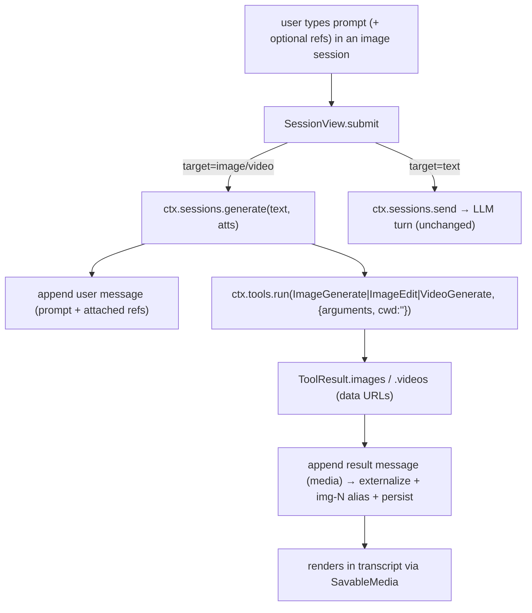

# Task 3 — Implementation guide: generation sessions

Guide for [task.md](task.md). Reuses the chat stack — a generation session is a session
whose composer sends to a media use-case instead of the LLM. Depends on **task 2** (the
`image`/`video` use-cases + the capability model). Reads target-first.

## Decision settled here — where the target lives

The PRD's D2 left this open. **Settling it toward the container type** (reverses the PRD's
tentative session-level lean): the sidebar already groups by `ContainerType`, so adding
`image`/`video` types gives the Images/Videos sections for free, reuses the container→session
model, and needs no parallel session-level grouping. `image`/`video` containers carry no
workspace root (like `chat`), just a target. *(This is a real re-add of a container type —
deliberate, unlike the dead `remote` type task 1 removed. Flag for the user.)*

## Per-root overview — `apps/desktop/src` when done

| Piece | What it is |
| --- | --- |
| `core/containers.ts` | `ContainerType = "chat" \| "local" \| "image" \| "video"`. A helper `containerTarget(type)` → the pinned pool (`text` / `image` / `video`). |
| `pages/workspace/Sidebar.tsx` | Blocks for **Images** and **Videos** (add-handlers create an `image`/`video` container + a first session), beside Chats/Local. |
| `pages/workspace/Composer.tsx` | Target-aware: **attach gating** by the pinned model's `input`; the model chip is an **inline pool picker** (not `navigate`); submit still delegates to the parent. |
| `pages/workspace/SessionView.tsx` | `submit` branches on the active container target: text → `ctx.sessions.send`; image/video → `ctx.sessions.generate`. |
| `core/sessions/engine.ts` (+ `store.ts`) | New **`generate(text, atts)`** path: append the prompt as a user message, run the media tool via `ctx.tools.run`, append the result message. No LLM loop. |
| `pages/workspace/ProgressPanel.tsx` | Target-aware right panel: **ContextWindow** for text, **CapabilitiesPanel** for a generation session (pinned model's inputs / max size / aspects). |
| `components/SavableMedia.tsx` (+ result card) | A **Send to chat** action alongside Save. |
| session model | A per-session **pinned model** override (`session.meta.model`) the inline picker sets; the send/generate path uses it, else the pool head. |

## Flow — a generation turn



## Contract

| Surface | Shape |
| --- | --- |
| `ContainerType` | `"chat" \| "local" \| "image" \| "video"` |
| `SessionEngine.generate` | `generate(text: string, atts: Attachments): Promise<void>` — the non-LLM turn |
| session pinned model | `session.meta.model?: { providerId: string; modelId: string }` — the inline picker's choice; read at call time, falls back to the pool head |
| Send-to-chat | `sendMediaToChat(media: Image \| Video, targetSessionId?): void` — seeds the media as an attachment on a chat session's composer (default: active chat) |

Generation results are **ordinary messages** (`role: "assistant"`, `images`/`videos` set) —
no new message shape, no synthetic tool-call.

## Data shapes

- **`Container.type`** gains `image`/`video`; `config` stays `{}` for them (no root).
- **`SessionRuntime` (`session.meta`)** gains optional `model?: {providerId, modelId}` (the
  pinned pick) — rides the existing whole-`meta` JSON column, no schema change
  ([ADR-0074](../../adr/0074-session-identity-vs-runtime.md)).
- No new store/table — results persist through `messages` + `media` repos exactly as chat media does.

## File touch-lists

### `apps/desktop/src` — surgical

| Path | Files | What |
| --- | --- | --- |
| `core/` | `containers.ts` | add `image`/`video` types + `containerTarget()`; icons |
| `core/sessions/` | `engine.ts` | `generate(text, atts)` — append user msg, run tool, append result; progress for video (poll) |
| `core/sessions/` | `store.ts` | a `pushGeneration(sid, prompt, atts)` / result-append helper (reuses `pushTurn`/`commitMessages`/media externalize); read `meta.model` |
| `pages/workspace/` | `SessionView.tsx` | `submit` branches on `containerTarget(activeContainer.type)` |
| `pages/workspace/` | `Composer.tsx` | attach gating from the pinned media model's `input`; model chip → inline pool dropdown (`slotOptions(useCase)` + set `meta.model`); target-aware placeholder |
| `pages/workspace/` | `Sidebar.tsx` | Images/Videos blocks + add-handlers (`createContainer({type:'image'|'video'})` → session) |
| `pages/workspace/` | `ProgressPanel.tsx` | branch: `ContextWindow` (text) vs new `CapabilitiesPanel` (generation) |
| `components/` | `SavableMedia.tsx` | "Send to chat" action → `sendMediaToChat` |
| `core/` | `ui.ts` or a small bridge | `sendMediaToChat` (seed a chat composer / route to a chat session) |
| `locales/` | `en.json`, `lt.json` | Images/Videos labels, capabilities-panel strings, send-to-chat, target placeholders (en/lt parity) |

## Key logic sketches

**Send-branch** (`SessionView.tsx`):

```ts
function submit(text: string, atts: Attachments) {
  const target = containerTarget(getActiveContainer()?.type); // "text" | "image" | "video"
  if (target === "text") void ctx.sessions.send(text, atts);
  else void ctx.sessions.generate(text, atts);               // image/video
}
```

**Generation turn** (`core/sessions/engine.ts`) — reuse the store's message plumbing, skip
the LLM loop:

```ts
async generate(text: string, atts: Attachments): Promise<void> {
  const sid = getActiveId();
  const target = containerTarget(getContainer(getSession(sid)?.containerId)?.type);
  pushTurn(sid, text, atts);                        // user message (prompt + any refs)
  const refs = atts.images ?? [];
  const tool = target === "video" ? "VideoGenerate" : refs.length ? "ImageEdit" : "ImageGenerate";
  const res = await this.ctx.tools.run({ id: newId(), name: tool, cwd: "",
    arguments: JSON.stringify({ prompt: text, /* aspect/quality/refs */ }) });
  if (res?.images || res?.videos) pushAssistantMedia(sid, res);   // result message → persist + alias
  else setErrorKind(sid, "other");
}
```

**Inline model picker** (`Composer.tsx`) — replace the `navigate("settings/provider")`
button with a dropdown of the session's pool:

```tsx
// options = slotOptions(useCaseForActiveContainer)  (task 2)
// value = session.meta.model ?? pool head; onChange → setSessionModel(sid, ref)
```

**Attach gating** — already keys on `provider.input` for chat; generalize to the *pinned
target model*'s `input`: image gen model with no image input → hide attach; edit/i2v-capable
→ show. (The existing "chat can't see images but an image model can use as reference" branch
in `Composer.addAttachments` is the same idea, now driven by the session's target model.)

**CapabilitiesPanel** (`ProgressPanel.tsx`) — for a generation session, replace the token
meter with the pinned model's `input` (accepted refs), `maxImageSize`/`maxVideoSize`, and
supported aspects.

## Verification plan

1. `pnpm typecheck` green after the `ContainerType` extension ripples (Sidebar/panels/agent
   panels handle the new types).
2. Create an Images session → prompt generates an image into the transcript; attach an image
   → it edits; reload → persists (web IDB + Electron SQLite).
3. Video session → generates with visible progress; attach gating matches the model's inputs.
4. Inline model picker switches the active pool model without leaving the composer.
5. Right panel shows capabilities in a generation session, the context meter in a chat.
6. Send-to-chat drops a generated image into a chat; the agent sees it as a user image; no
   generation appears in chat context otherwise.
7. `pnpm test` green.
