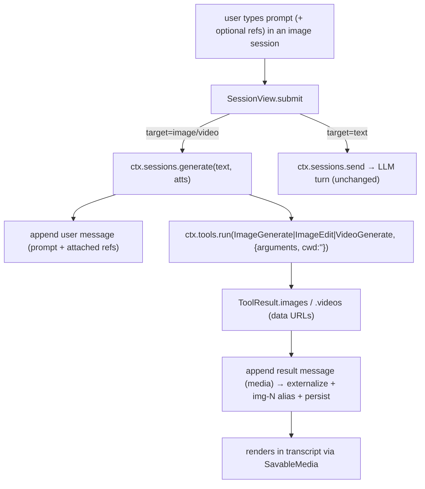

# Task 3 — Implementation guide: generation sessions

Guide for [task.md](task.md). Reuses the chat stack — a generation session is a session
whose composer sends to a media use-case instead of the LLM. Depends on **task 2** (the
`image`/`video` use-cases + the capability model). Reads target-first.

## D2 — target = container type (confirmed by the user)

`ContainerType` gains `image`/`video`; the container's type carries the target. Chosen over a
session-level field because a session must belong to a container anyway (`containerId` never
null, [ADR-0046](../../adr/0046-typed-containers.md)) — a field would still need a home
container, so the type is the natural carrier and the sidebar's existing container-type
grouping gives the Images/Videos sections for free. `image`/`video` containers carry no
workspace root (like `chat`), just the target. Deliberate first-class kinds, not the dead
`remote` type task 1 pruned. **`containerTarget(type)` — the total mapping:** `chat`→`text`,
`local`→`text`, `image`→`image`, `video`→`video`, and **`undefined`→`text`** (so
`SessionView.submit` never mis-routes before a container resolves).

## Per-root overview — `apps/desktop/src` when done

| Piece | What it is |
| --- | --- |
| `core/containers.ts` | `ContainerType = "chat" \| "local" \| "image" \| "video"`. `containerTarget(type)` → the pool: chat/local → `text`, image → `image`, video → `video`, undefined → `text`. |
| `pages/workspace/Sidebar.tsx` | Blocks for **Images** and **Videos** (add-handlers create an `image`/`video` container + a first session), beside Chats/Local. |
| `pages/workspace/Composer.tsx` | Target-aware: **attach gating** by the pinned model's `input`; the model chip is an **inline pool picker** (not `navigate`); submit still delegates to the parent. |
| `pages/workspace/SessionView.tsx` | `submit` branches on the active container target: text → `ctx.sessions.send`; image/video → `ctx.sessions.generate`. |
| `core/sessions/engine.ts` (+ `store.ts`) | New **`generate(text, atts)`** path: append the prompt as a user message, run the media tool via `ctx.tools.run`, append the result message. No LLM loop. |
| `pages/workspace/ProgressPanel.tsx` | Target-aware right panel: **ContextWindow** for text, **CapabilitiesPanel** for a generation session (pinned model's inputs / max size / aspects). |
| `components/SavableMedia.tsx` (+ result card) | A **Send to chat** action alongside Save. |
| session model | A per-session **pinned model** override (`session.meta.pinnedModel`, distinct from the churning `lastModel`) the inline picker sets; `generate()` resolves it to an `LLMConfig` and threads it into the tool call so it actually drives generation (not just the label). |
| generation knobs | The composer surfaces **aspect · quality** (image) / **aspect · quality · duration** (video) from `getAppConfig().imageGen/videoGen` defaults, bounded by the model's max-size; **persisted per session** in `session.meta`. |

## Flow — a generation turn



## Contract

| Surface | Shape |
| --- | --- |
| `ContainerType` | `"chat" \| "local" \| "image" \| "video"` |
| `SessionEngine.generate` | `generate(text: string, atts: Attachments): Promise<void>` — the non-LLM turn |
| session pinned model | `session.meta.pinnedModel?: { providerId: string; modelId: string }` — the inline picker's choice (named distinctly from the churning `lastModel`). |
| `ToolCallRequest.target?` | optional `LLMConfig` override, same "non-model, engine-filled" lane as `mediaRefs`/`meta`. When set, the media tools use it **instead of** `llm.resolve(pool)` (the pool head). `generate()` fills it from the resolved `pinnedModel`; the agent never sets it. **This is how a pinned pick actually reaches generation (AC4).** |
| Send-to-chat | `sendMediaToChat(media: Image \| Video, targetSessionId?): void` — seeds the media as a user attachment on a chat's composer; defaults to the active chat, and **creates a chat** if none exists. |

Generation results are **ordinary messages** (`role: "assistant"`, `images`/`videos` set) —
no new message shape, no synthetic tool-call.

## Data shapes

- **`Container.type`** gains `image`/`video`; `config` stays `{}` for them (no root).
- **`SessionRuntime` (`session.meta`)** gains optional `pinnedModel?: {providerId, modelId}`
  (the picker's choice — named apart from the existing `lastModel` label) and the per-session
  generation knobs (aspect/quality/duration) — all ride the existing whole-`meta` JSON column,
  no schema change ([ADR-0074](../../adr/0074-session-identity-vs-runtime.md)).
- No new store/table — results persist through `messages` + `media` repos exactly as chat media does.

## File touch-lists

### `apps/desktop/src` — surgical

| Path | Files | What |
| --- | --- | --- |
| `core/` | `containers.ts` | add `image`/`video` types + `containerTarget()`; icons |
| `core/sessions/` | `engine.ts` | `generate(text, atts)` — append user msg, resolve `pinnedModel`→`target`, run the tool, append the result. The **video** tool call *blocks* (the video provider polls `/videos/{id}` internally); the UI shows an elapsed-time / typical-duration state — there is no per-step stream to surface (that would be a provider enhancement, deferred). |
| `core/sessions/` | `store.ts` | `pushGeneration(sid, prompt, atts)` + a result-append helper that **externalizes media + bumps `mediaSeq` (img-N/vid-N) + `commitMessages`** (the real persistence, reusing the chat plumbing); reads `meta.pinnedModel` |
| `pages/workspace/` | `SessionView.tsx` | `submit` branches on `containerTarget(getActiveContainer()?.type)` (undefined → text) |
| `pages/workspace/` | `Composer.tsx` | attach gating from the pinned target model's `input` (image + video); model chip → inline pool dropdown (`slotOptions(useCase)` + set `meta.pinnedModel`); aspect/quality(/duration) knobs from the shared config, per-session; target-aware placeholder |
| `pages/workspace/` | `Sidebar.tsx` | Images/Videos blocks + add-handlers (`createContainer({type:'image'|'video'})` → session) |
| `pages/workspace/` | `ProgressPanel.tsx` | branch: `ContextWindow` (text) vs new `CapabilitiesPanel` (generation) |
| `components/` | `SavableMedia.tsx` | "Send to chat" action → `sendMediaToChat` |
| `core/` | `ui.ts` or a small bridge | `sendMediaToChat` (seed a chat composer / route to a chat session) |
| `locales/` | `en.json`, `lt.json` | Images/Videos labels, capabilities-panel strings, send-to-chat, target placeholders (en/lt parity) |

## Key logic sketches

**Send-branch** (`SessionView.tsx`):

```ts
function submit(text: string, atts: Attachments) {
  const target = containerTarget(getActiveContainer()?.type); // "text" | "image" | "video"
  if (target === "text") void ctx.sessions.send(text, atts);
  else void ctx.sessions.generate(text, atts);               // image/video
}
```

**Generation turn** (`core/sessions/engine.ts`) — reuse the store's message plumbing, skip
the LLM loop:

```ts
async generate(text: string, atts: Attachments): Promise<void> {
  const sid = getActiveId();
  const s = getSession(sid);
  const pool = containerTarget(getContainer(s?.containerId)?.type);   // "image" | "video"
  pushGeneration(sid, text, atts);                                    // user message (prompt + refs)
  const imgRefs = atts.images ?? [], vidRefs = atts.videos ?? [];
  const tool = pool === "video" ? "VideoGenerate" : imgRefs.length ? "ImageEdit" : "ImageGenerate";
  // The pinned pick actually drives generation via `target` (AC4); absent → the tool resolves the pool head.
  const target = s?.meta.pinnedModel ? resolveConfigByRef(pool, s.meta.pinnedModel) : undefined;
  const knobs = s?.meta.gen ?? {};                                    // aspect/quality/duration (per session)
  const res = await this.ctx.tools.run({
    id: newId(), name: tool, cwd: "", target,
    arguments: JSON.stringify({ prompt: text, ...knobs }),            // refs ride via atts→mediaRefs (image AND video → i2v/v2v)
  });
  if (res?.images || res?.videos) appendGenerationResult(sid, res);   // externalize + mediaSeq + commitMessages
  else setErrorKind(sid, "other");
}
```

**Inline model picker** (`Composer.tsx`) — replace the model chip's current
`navigate("settings/providers")` with a dropdown of the session's pool:

```tsx
// options = slotOptions(useCaseForActiveContainer)  (task 2)
// value = session.meta.pinnedModel ?? pool head; onChange → setSessionPinnedModel(sid, ref)
```

**Attach gating** — already keys on `provider.input` for chat; generalize to the *pinned
target model*'s `input`: image gen model with no image input → hide attach; edit/i2v-capable
→ show. (The existing "chat can't see images but an image model can use as reference" branch
in `Composer.addAttachments` is the same idea, now driven by the session's target model.)

**CapabilitiesPanel** (`ProgressPanel.tsx`) — for a generation session, replace the token
meter with the pinned model's `input` (accepted refs) and `maxImageSize`/`maxVideoSize`. The
supported aspects come from the fixed **`ASPECTS`** set (`helpers/generation.ts` — the same
list the tools offer), not a per-model field.

## Verification plan

1. `pnpm typecheck` green after the `ContainerType` extension ripples (Sidebar/panels/agent
   panels handle the new types).
2. Create an Images session → prompt generates an image into the transcript; attach an image
   → it edits; reload → persists (web IDB + Electron SQLite).
3. Video session → generates with an elapsed-time / typical-duration indicator while the tool
   call blocks (no fake %, not a hung spinner); attach gating matches the model's inputs (image
   keyframes → i2v, a clip → v2v).
4. Inline model picker switches the active pool model without leaving the composer.
5. Right panel shows capabilities in a generation session, the context meter in a chat.
6. Send-to-chat drops a generated image into a chat; the agent sees it as a user image; no
   generation appears in chat context otherwise.
7. `pnpm test` green.
