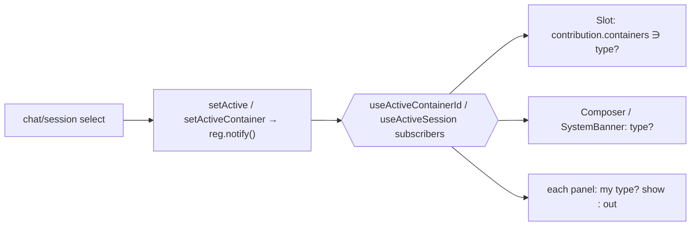
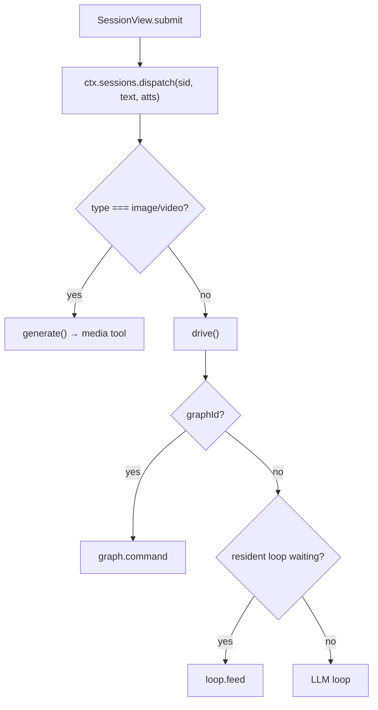

# task4 — implementation

Build guide for [task.md](task.md): make `container.type` the one signal, and have every element self-gate
on it. Additive — no new session field, the four ids untouched.

## Per-root overview

| Root | What changes |
|------|--------------|
| `core/containers.ts` | **Unchanged.** No predicates, no aggregate — `container.type` is the only decider, checked directly at each site against the values it cares about. (`audio` joins `ContainerType` later, with its container.) |
| `lib/registry.ts` + `components/Slot.tsx` | `Contribution` gains `containers?: ContainerType[]`; `Slot` renders a contribution only when the active session's `container.type` is in its list (undefined = all). This is the UI self-gate. |
| `core/tools/*` | `BaseTool.needsWorkspace()` → `BaseTool.containers()` (supported types; default = conversation). `ToolFilterParams.hasWorkspace` → `containerType`. `ToolRunCtx`/`ToolCallRequest` carry the active `Container`. Filter drops a tool whose `containers()` excludes the active type. |
| `core/sessions/system.ts` | `capabilitiesFor` passes `containerType` to the filter; the fs/workspace prompt block gates on `container.type === "local"` (already the `ws` derivation). No behavior change for chat/local. |
| `core/sessions/engine.ts` | `runTurn`/`generate` unify into one dispatch keyed on `container.type`; `runAgent` routes to a conversation container. `ToolCallRequest` stamped with the active container. |
| `core/agents.ts` + `helpers/agents/catalog.ts` | `Agent.workspace: boolean` → `Agent.containers?: ContainerType[]`; `agentsForContext`/`catalogAgents` take the active `container.type`. |
| `pages/workspace/*` | `SessionView` gates `SystemBanner` to conversation types; the media/text `submit` branch moves behind the unified dispatch. `ProgressPanel` already branches (keep). |
| `pages/agents/*`, `pages/graphs/*`, `pages/browser/*` | Right-panel contributions declare `containers`; the scattered `inWorkspace`/`needsWorkspace` `return null`s are deleted (the `Slot` gate replaces them). `AgentEditView` workspace checkbox → a container-types picker. |
| plugins (`database`, `mcp`) | Their right-panel contributions + `local`-tier tools declare `containers` (drop `needsWorkspace()`). |

## Flows

Active select → one broadcast → every element self-gates:



Turn dispatch keyed on `container.type` (one router; replaces the split `drive()` graph branch + `submit`
generation branch):



## Contracts (changed / new)

| Symbol | Before | After |
|--------|--------|-------|
| `lib/registry.ts` `Contribution` | `{region,id,pluginId?,order?,render}` | `+ containers?: ContainerType[]` (undefined = all types) |
| `BaseTool` constructor | `(config: () => Config)` | `+ container: () => Container \| undefined` — re-seeded per call on the same rail as `config` |
| `BaseTool.needsWorkspace()` | fs tools override → true | **removed** — the gate moves into `canRun()`: `BaseWorkspaceTool.canRun()` = `this.container()?.type === "local"` (model-checking overrides `&& super.canRun()`) |
| `BaseTool.run(args, cwd, signal, ctx)` | `cwd?: string` param | **`run(args, signal, ctx)`** — the workspace root is `this.container()?.config.root` (via a `this.cwd()` helper) |
| `ToolFilterParams` | `hasWorkspace?: boolean` | `container?: Container` — the dispatcher re-seeds the getter from it before `filter()` |
| `ToolCallRequest` | `cwd` on the call | `cwd` **removed** → `+ container?: Container`; the dispatcher re-seeds the getter from it before `run()` |
| `ToolFilterEntry` | `needsWorkspace: boolean` | **removed** — `canRun()` is the gate; the workspace prompt lists fs tools via `container.type === "local"` |
| `core/agents.ts` `Agent` | `workspace: boolean` | `containers?: ContainerType[]` (undefined = conversation) |
| `agentsForContext(hasWorkspace)` / `catalogAgents(hasWorkspace)` | boolean | `(type: ContainerType)` |
| `SessionEngine` | `send` + `generate` (two entry points) | `dispatch(text, atts)` routes by `container.type`; `send`/`generate` become internal |

Graph is unchanged: a `graphId` on a `chat`/`local` session; `drive()` already routes it. `fullSystemFor`
already returns base-only for `graphId` — keep.

## Data shapes

```ts
// core/containers.ts — unchanged in task4
export type ContainerType = "chat" | "local" | "image" | "video"; // audio added later, with its container
// No isMediaType / isConversationType predicates — each site checks container.type directly
// against the specific values it cares about. The type is the only decider; nothing sits on top.
```

Declared support per element (the self-gate data):

| Element | `containers` |
|---------|--------------|
| right-panel `progress` | undefined (all) — it already renders context vs. capabilities by type |
| `agents`, `sub-agent-cleanup`, `agent-permissions`, `graphs`, `browser-fleet` | `["chat","local"]` |
| plugin panels (`database-connections`, `mcp-servers`) | `["chat","local"]` |
| `SystemBanner` | conversation only (gated in `SessionView`) |
| local fs tools (`local/base`) | `["local"]` |
| general tools (default) | conversation (undefined) |
| media tools (ImageGenerate/ImageEdit/VideoGenerate) | invoked by `generate()` directly — not filtered into a ceiling; unchanged |

## Touch-list — `Path | Files | What`

- **containers** · `core/containers.ts` · **no change** — `container.type` is checked directly everywhere; `audio` joins `ContainerType` later with its container.
- **registry** · `lib/registry.ts`, `components/Slot.tsx` · add `containers?` to `Contribution`; `Slot`
  reads `useActiveContainerId()` → `getContainer()?.type` and filters `!c.containers || c.containers.includes(type)`.
- **tools/core** · `core/tools/base.ts` (constructor `+ container` getter, `this.cwd()` helper, drop
  `needsWorkspace`, `run()` drops `cwd`), `core/tools/local/base.ts` (`canRun()` = `container?.type ===
  "local"`, `getRoot` via `this.cwd()`), `core/tools/registry.ts` (ctor takes the container getter, passes
  it to each tool; `filter()` drops the `hasWorkspace`/`needsWorkspace` branch — `canRun()` gates; `run()`
  drops `cwd`), `core/tools/types.ts` (`ToolCtor` gains the getter; `ToolFilterParams.hasWorkspace` →
  `container`; drop `ToolFilterEntry.needsWorkspace`), `llm/types.ts` (`ToolCallRequest.cwd` → `container`).
- **tool dispatchers re-seed the getter** · `web/init.ts`, `electron/tools.ts` · a module `container` var
  set from `params.container` (filter) / `call.container` (run) before the registry runs — same pattern as
  the existing `config` re-seed; registry constructed with `() => container`.
- **every tool that used `cwd`** · `core/tools/local/*`, `general/{fetch,imageGenerate,videoGenerate,imageEdit}`,
  `helpers/imageSave.ts`, `plugins/*/tools/*` · drop the `cwd` param from `run()`; read `const cwd =
  this.cwd()` at the top (body unchanged). Model-checking `canRun` overrides add `&& super.canRun()`.
- **sessions/system** · `core/sessions/system.ts` · `capabilitiesFor` → `filter({ container, … })`;
  `fsAccess = container?.type === "local"`, `wsTools` = the filtered fs-tool names; keep `fullSystemFor` graph branch.
- **sessions/engine** · `core/sessions/engine.ts` · add `dispatch()` routing on `container.type` (image/video → `generate`, else `send`); stamp
  `container` onto every `ToolCallRequest` it builds; `runAgent` — if the active container isn't
  conversation, reuse/create a `chat` container (mirror `ui.ts` `sendMediaToChat`) for the agent session.
- **agents** · `core/agents.ts`, `core/tools/helpers/agents/catalog.ts`, `core/tools/engine/agents/{RunAgent,ListAgents}.ts` ·
  `Agent.workspace`→`containers`; `agentsForContext`/`catalogAgents(type)`; `RunAgent`/`ListAgents` read the
  active container type off `EngineCtx` (carry the container on `ec`).
- **workspace UI** · `pages/workspace/SessionView.tsx`, `Composer.tsx` · `submit` → `ctx.sessions.dispatch`;
  gate `SystemBanner` on `container.type` (`chat`/`local` only).
- **agent/graph/browser UI** · `pages/agents/register.tsx`, `pages/graphs/register.tsx`,
  `pages/browser/register.tsx` (+ the panels) · add `containers: ["chat","local"]`; delete the
  `inWorkspace`/`needsWorkspace` `return null`s in `AgentsPanel`/`GraphsPanel`/`AgentRunView`;
  `AgentEditView` workspace checkbox → container-types picker.
- **plugins** · `plugins/*/ui/register.tsx`, `plugins/*/tools/local/base.ts`, `plugins/mcp/tool.ts` ·
  declare `containers`; drop `needsWorkspace()`.
- **locales** · en/lt · rename the `agents.workspace` label to the container-types picker; any
  `needsWorkspace` copy.

## Key logic sketches

Slot self-gate:

```ts
// components/Slot.tsx
const type = getContainer(useActiveContainerId())?.type;
contributionsFor(region)
  .filter((c) => !c.pluginId || plugins[c.pluginId]?.enabled)
  .filter((c) => !c.containers || (type != null && c.containers.includes(type)))
  .map((c) => <Fragment key={c.id}>{c.render()}</Fragment>)
```

Container injected + re-seeded per call (same rail as `config`):

```ts
// core/tools/base.ts
constructor(protected readonly config: () => Config, protected readonly container: () => Container | undefined) {}
protected cwd(): string | undefined { return (this.container()?.config as { root?: string })?.root; }

// core/tools/local/base.ts — the gate is canRun, reading the injected container:
override canRun(): boolean { return this.container()?.type === "local"; }

// web/init.ts and electron/tools.ts — re-seed before the registry runs (like config):
let container: Container | undefined;
const reg = new ToolRegistry(() => ctx.config, () => container, MODULES);
filter: (params) => { container = params?.container; return reg.filter(params); },
run:    (call)   => { container = call.container;   return reg.run(call); },
```

The `filter()` workspace branch is deleted — `canRun()` (now container-aware) is the whole gate.

Unified dispatch + agent routing (`engine.ts`):

```ts
async dispatch(text: string, atts: Attachments = {}) {
  const sid = getActiveId();
  const type = getContainer(getSession(sid)?.containerId)?.type;
  if (type === "image" || type === "video") return this.generate(text, atts); // media types run the tool
  return this.send(text, atts);                                               // chat/local → drive(): graph / feed / loop
}

runAgent(agent, task, opts = {}) {
  let containerId = opts.containerId ?? getActiveContainerId() ?? "";
  const type = getContainer(containerId)?.type;
  if (type === "image" || type === "video") {                 // never create an agent in a media container
    containerId = getContainersByType("chat")[0]?.id
      ?? (/* create a chat container */);
  }
  // …existing createSession({ …, containerId, agentId }) + sendTo…
}
```

`run()` loses `cwd` (the tool reads `this.cwd()` from the injected container):

```ts
return tool.run(args, controller.signal,
  { imageOutputDir: call.imageOutputDir, mediaRefs: call.mediaRefs, sessionId: call.sessionId,
    meta: call.meta, target: call.target });
```

## Verification plan

- **Typecheck** — `pnpm typecheck` (milestone gate).
- **Tests** (`apps/desktop/tests/`):
  - `dispatch` routes `image`/`video` → `generate`, `chat`/`local` → `send` (extend `containers.test.ts` /
    the engine harness).
  - `runAgent` from an `image`/`video` active container creates the agent session in a `chat` container,
    never a media one.
  - tool `filter({ containerType })`: a `local` tool is absent for `chat`, present for `local`; a general
    tool present for both.
  - a UI `Slot` contribution with `containers: ["chat","local"]` is hidden when the active type is `image`.
- **Full suite** — `pnpm test`; **web build** — `pnpm build`.
- **Manual** (both targets): switch between a Chat, a Local, and an Images session — confirm the right
  panel, banner, composer, and tool ceiling reconfigure in one pass; confirm Play-agent from an Images
  session lands the run in a chat.

## Deferred / open

- **`audio`** — type reserved; no container/creation path (task.md out-of-scope).
- **`AgentEditView` container-types picker** — exact control (checkboxes over conversation types) settled
  during build; default `undefined` (all conversation) preserves today's non-workspace agents.
- **`EngineCtx` shape** — whether to rename `workspace` → `container` or add `container` alongside; keep the
  smaller diff unless it forces churn.
